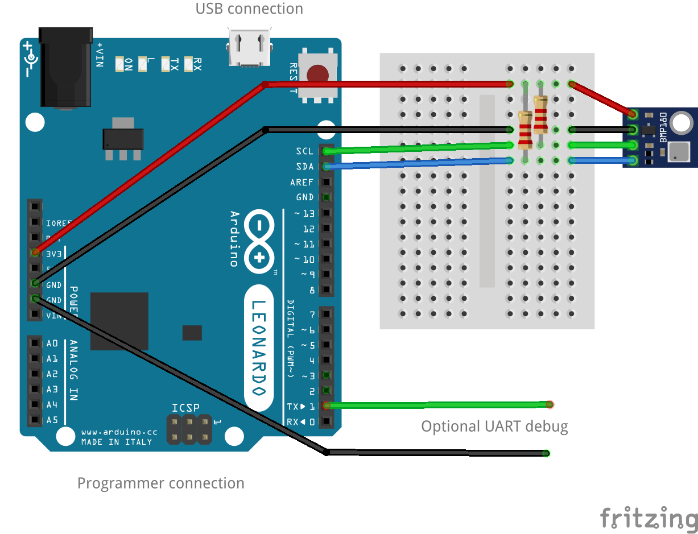

# I2C-Mega-USB ATmega32U4 clone of the i2c-tiny-usb
## Cheap and simple I²C to USB interface

Attach any I2C clients (Wii Nunchuk, thermo sensor, AD converter, display, relay driver, ...) to your PC via USB ... quick, easy and cheap! Drivers for Linux, Windows and MacOS available.

The i2c-tiny-usb project is an open source/open hardware project. The goal of i2c-tiny-usb is to provide a cheap generic i2c interface to be attached to the USB. It is meant as a replacement for those simple and cheap printer port to I2C adapters. A USB solution has several advantages incl. the built-in power supply and a more future proof interface. Furthermore no cpu intense bitbanging is required on the host side. This USB solution even requires less parts than some printer port solutions.

I2C-Mega-USB is a compatible clone of Till Harbaum’s i2c-tiny-usb. The firmware has no software in common with Till’s implementation but is compatible with the i2c-tiny-usb driver found in the mainline Linux kernel. As a result it will work out of the box without requiring any special software on the host computer. (Even these texts are shamelessly ripped from i2c-tiny-usb and i2c-star, which is a similar project for STM32)

I2C-Mega-USB utilizes ATmega32U4 with hardware I2C and USB, which should be better than the original bitbang I2C and software USB.

## Hardware setup

The firmware can be easily ported but has been tested on an ATmega32U4 based breakout board (Arduino Leonardo).
See LUFA documentatation for possible supported boards.
Connections required are:

- USB to host computer
- I2C bus SDA and I2C bus SCL. Add pull up resistors, if needed (for example 2.2kohm resistors to +3.3V). ATmega has internal pullups, but they are often considered too weak.
- ICSP connector for uploading the firmware
- [Optional; debug only] TX1: UART TX and RX0: UART RX

NOTE you need a separate programmer (for example USBtinyISP).
If you use Arduino module with a bootloader, you may be able to upload the firmware once.
Then the firmware will change USB Vendor and Product Ids and you won't be able to program second time.




## Install

- Install avr-gcc compiler toolchain and avrdude. If you have used Arduino IDE, you may have it already (add arduino-x.x.x/hardware/tools/avr/bin/ to PATH).
- Clone this repo:
```
git clone https://github.com/kasbert/I2C-Mega-USB
```
- Fetch the libraries:
```
cd I2C-Mega-USB; git submodule update --init --recursive
```
- Build the firmware:
```
make
```
- Use programmer to install the firmware.
```
make avrdude
```

## Examples

Note that the +i2c_dev+ kernel module needs to be loaded before using any of the
+i2c-tools+ utilities.

Linux users may find useful to allow normal user to access the i2c device.

    $ echo 'SUBSYSTEMS=="usb" ATTRS{idVendor}=="1c40" ATTRS{idProduct}=="0534" GROUP="dialout" MODE="0660"'| sudo tee /etc/udev/rules.d/99-i2c-tiny-usb.rules
    $ sudo systemctl restart udev

    $ i2cdetect -l
    ...
    i2c-9	i2c       	i2c-tiny-usb at bus 002 device 007	I2C adapter

    $ i2cdetect -y 9

    # With BMP180 you just might get some data..
    $ i2cset -y 9 0x77 0xf4 0x2e
    $ i2cget -y 9 0x77 0xf6 i 3
    0x75 0x7a 0x00


To make Linux aware of I2C devices on the bus, use the following command:

    $ echo bmp085 0x77 | sudo tee /sys/class/i2c-adapter/i2c-9/new_device

    $ cat /sys/class/i2c-adapter/i2c-9/9-0077/temp0_input
    # BMP085 requires a driver (https://github.com/bsapundzhiev/bmp085)

Where +tmp102+ is the name of the kernel driver you want to associate with the
I2C device, +0x77+ is the I2C device's 7-bit address, and +i2c-9+ is the bus
number the kernel assigned to the i2c-star adapter (appears as +i2c-tiny-usb+
in +dmesg+ and +i2cdetect+).


## Credits
* i2c-tiny-usb. [https://github.com/harbaum/I2C-Tiny-USB]
* LUFA - The Lightweight USB Framework for AVRs [https://github.com/abcminiuser/lufa/]
* Arduino Core Two Wire Interface [https://github.com/arduino/ArduinoCore-avr/blob/master/libraries/Wire/src/utility/twi.c]
* i2c-star [https://github.com/daniel-thompson/i2c-star]
